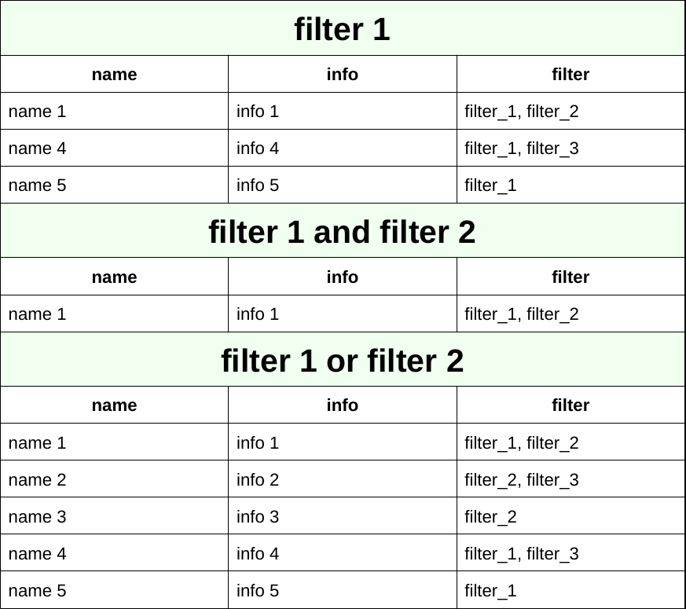

<p align="center">
  <!-- CircleCI Tests -->
  <a href="https://circleci.com/gh/BjoernLudwigPTB/pyxml2pdf"></a>
  <!-- ReadTheDocs Documentation -->
  <a href="https://pyxml2pdf.readthedocs.io/en/latest/">
    
  </a>
  <!-- Codacy Code Quality -->
  <a href="https://www.codacy.com/manual/blus_projects/pyxml2pdf?utm_source=github.com&amp;utm_medium=referral&amp;utm_content=BjoernLudwigPTB/pyxml2pdf&amp;utm_campaign=Badge_Grade">
    
  </a>
  <!-- CodeCov(erage) -->
  <a href="https://codecov.io/gh/BjoernLudwigPTB/pyxml2pdf">
    
  </a>
  <!-- PyPI Version -->
  <a href="https://pypi.org/project/pyxml2pdf">
    
  </a>
  <!-- PyPI Python Version -->
  <a href="https://pypi.org/project/pyxml2pdf">
    
  </a>
  <!-- PyPI License -->
  <a href="https://www.gnu.org/licenses/lgpl-3.0.en.html">
    
  </a>
</p>

<h1 align="center">Convert your XML into a Pdf table</h1>

<p align="justify">
Generate a <b>multi-page PDF file</b> from an <b>XML file</b> with the contents
displayed in <b>several tables</b> based on <b>filter criteria</b>.
</p>

## Table of content

- [💫 Quickstart](#quickstart)
- [👓 Example](#example)
- [📖 Documentation](#documentation)
- [💻 Installation](#installation)
- [💨 Coming soon](#coming-soon)
- [👋 Get in touch](#get-in-touch)
- [💎 Acknowledgement](#acknowledgement)
- [⚠ Disclaimer](#disclaimer)
- [️© License](#license)

## 💫Quickstart 

As a starting point you could call

```shell
$ python -m pyxml2pdf.main input/template.xml
```

which will download a publicly available XML file into the folder *input* and process
it as desired to produce the output files (one file containing all generated pages in 
landscape and additionally one file per page rotated into portrait) and place them in 
the subfolder *output*.

The intended way of using this software is calling
[_main.py_](pyxml2pdf/main.py) with the following command line parameters

- positional arguments:
  - `<local_file>` The local file path to the XML file. If this file is not present,
    the optional input parameter '--url' needs to be provided with the URL from which
    the file shall be downloaded.

- optional arguments:
  - `-u <URL>, --url <URL>`
    The URL from which the file shall be downloaded. This is only used, if the specified
    local file is not present. Defaults to ['https://github.com/BjoernLudwigPTB/pyxml2pdf/blob/main/input/template.xml'](https://github.com/BjoernLudwigPTB/pyxml2pdf/blob/main/input/template.xml)
  - `-p <path to Pdf file>, --pdf <path to Pdf file>`
    The file path to store the created PDF to. Defaults to `'output/template.pdf'`

## 👓Example

As an example we look at our _input/template.xml_ and the processed result. Imagine you
have an XML file with similar groups of tags and subtags.

```xml
<main_tag>
    <row_tag>
        <name_tag>Name 1</name_tag>
        <info_tag>Info 1</info_tag>
        <filter_tag>filter_1, filter_2</filter_tag>
    </row_tag>
    <row_tag>
        <name_tag>Name 2</name_tag>
        <info_tag>Info 2</info_tag>
        <filter_tag>filter_2, filter_3</filter_tag>
    </row_tag>
    <row_tag>
        <name_tag>Name 3</name_tag>
        <info_tag>Info 3</info_tag>
        <filter_tag>filter_2</filter_tag>
    </row_tag>
    <row_tag>
        <name_tag>Name 4</name_tag>
        <info_tag>Info 4</info_tag>
        <filter_tag>filter_1, filter_3</filter_tag>
    </row_tag>
    <row_tag>
        <name_tag>Name 5</name_tag>
        <info_tag>Info 5</info_tag>
        <filter_tag>filter_1</filter_tag>
    </row_tag>
</main_tag>
```

Now you want to visualize all `row_tag`s with their subtags `name_tag` and `info_tag`
fed into separate columns. And lastly you want to group those `row_tags` which 
satisfy certain filter criteria, that is their `filter_tag` contains certain
combinations of comma-separated texts. Those groups of `row_tag`s are extracted into
several subtables each with a separating heading line and the corresponding column
headings.



## 📖Documentation

The API reference you can find on [ReadTheDocs](https://pyxml2pdf.readthedocs.io/).

## 💻Installation

The installation of pyxml2pdf is as straightforward as the Python 
ecosystem suggests. Just [create a virtual environment](https://docs.python.org/3/library/venv.html)
and install it via: 

```shell
(venv) $ pip install pyxml2pdf
```

## 💨Coming soon
 
The next big step will be the deployment on [Heroku](https://www.heroku.com).

## 👋Get in touch
 
In case you have any questions on this project do not hesitate to get in touch with
[us](https://github.com/BjoernLudwigPTB/pyxml2pdf/graphs/contributors).

## 💎Acknowledgement

This project was prepared by [Wojciech Kur](https://github.com/kuras120) in his
repository [XMLtoPDFConverter](https://github.com/kuras120/XMLToPDFConverter). We are
grateful for his effort in designing the basic structure and built upon his main ideas.
At some point our project diverged as much from his original work, as for us to justify
to decouple our project from his. The fork is still kept (and maintained) as a special 
case in [pyacb2pdf](https://github.com/BjoernLudwigPTB/pyacb2pdf).

## ⚠Disclaimer

This software is developed in sole responsibility of Björn Ludwig. The software is made
available "as is" free of cost. The author assumes no responsibility whatsoever for its
use by other parties, and makes no guarantees, expressed or implied, about its quality, 
reliability, safety, suitability or any other characteristic. In no event will the 
author be liable for any direct, indirect or consequential damage arising in connection
with the use of this software.
## ©License

pyxml2pdf is distributed under the [GPLv3 license](https://github.com/BjoernLudwigPTB/pyxml2pdf/blob/main/LICENSE).
